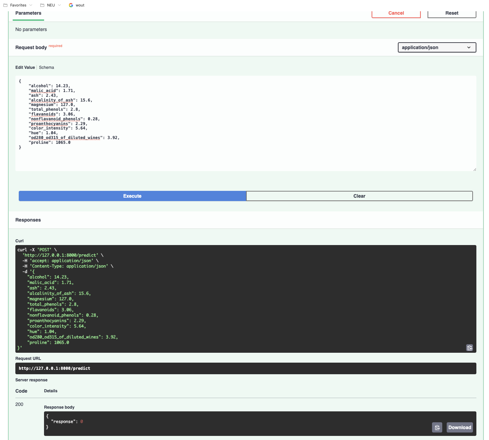

# FastAPI Wine Classification API

This project exposes a machine learning model as a REST API using FastAPI.

The API takes chemical measurements from the Wine dataset and predicts the wine class using a Support Vector Classifier (SVC) trained with scikit-learn.

## What This Project Does

- Loads the Wine dataset from scikit-learn
- Trains an SVC model on the dataset
- Saves the trained model in the `model/` folder
- Exposes a `/predict` endpoint to return a predicted class for a wine sample

## Project Structure

```text
FastAPI_Labs/
├── assets/
├── model/
│   ├── iris_model.pkl
│   └── wine_model.pkl
├── src/
│   ├── __init__.py
│   ├── data.py
│   ├── main.py
│   ├── predict.py
│   └── train.py
├── README.md
└── requirements.txt
```

## Requirements

Install the dependencies:

```bash
pip install -r requirements.txt
```

## How To Run

1. Move into the source folder:

```bash
cd src
```

2. Train the model:

```bash
python train.py
```

3. Start the FastAPI server:

```bash
uvicorn main:app --reload
```

4. Open the API in your browser:

```text
http://127.0.0.1:8000/docs
```

Swagger UI preview:



## API Endpoints

### `GET /`

Returns a simple health response:

```json
{
  "status": "healthy"
}
```

### `POST /predict`

Accepts a JSON request body with 13 Wine dataset features and returns the predicted class.

Example request:

```json
{
  "alcohol": 14.23,
  "malic_acid": 1.71,
  "ash": 2.43,
  "alcalinity_of_ash": 15.6,
  "magnesium": 127.0,
  "total_phenols": 2.8,
  "flavanoids": 3.06,
  "nonflavanoid_phenols": 0.28,
  "proanthocyanins": 2.29,
  "color_intensity": 5.64,
  "hue": 1.04,
  "od280_od315_of_diluted_wines": 3.92,
  "proline": 1065.0
}
```

Example response:

```json
{
  "response": 0
}
```

## Testing With Postman

- Method: `POST`
- URL: `http://127.0.0.1:8000/predict`
- Header: `Content-Type: application/json`
- Body: Use the example JSON shown above

## Notes

- Run the app from the `src/` directory so the relative path to the saved model works correctly.
- The model prediction output is a class label: `0`, `1`, or `2`.
