# FastAPI Wine Classification API

## **Objective**

This lab aims to teach participants the fundamentals of building and deploying machine learning models as REST APIs using FastAPI. Through hands-on exercises, participants will learn how to:

- Load and prepare datasets using scikit-learn
- Train a machine learning model (Support Vector Classifier)
- Save trained models for production use
- Expose ML models through REST API endpoints using FastAPI
- Test API endpoints using Swagger UI and Postman
- Handle JSON request/response payloads
- Deploy API servers to localhost

## **What This Project Does**

This project demonstrates a complete ML-to-API workflow:

- Loads the Wine dataset from scikit-learn (13 chemical features across 3 wine classes)
- Trains a Support Vector Classifier (SVC) model on the dataset
- Saves the trained model in the `model/` folder for inference
- Exposes a FastAPI application with `/` (health check) and `/predict` (classification) endpoints
- Allows real-time predictions on new wine samples via REST API

## **Project Structure**

```text
Lab1/
├── assets/
├── images/
│   ├── screenshot-01.png
│   ├── screenshot-02.png
│   ├── ... (14 screenshots total)
│   └── screenshot-14.png
├── model/
│   ├── iris_model.pkl
│   └── wine_model.pkl
├── src/
│   ├── __init__.py
│   ├── data.py
│   ├── main.py
│   ├── predict.py
│   └── train.py
├── README.md
└── requirements.txt
```

---

## **Tutorial Video**

For a visual guide to this lab, watch the tutorial video:

[FastAPI Wine Classification Tutorial](https://www.youtube.com/watch?v=example) _(Insert video link here)_

---

## **Lab Steps**

### **Step 1: Prerequisites & Installation**

Ensure you have the following:

- Google Cloud Platform account with Compute Engine enabled
- SSH access to create instances (gcloud CLI or GCP Console)
- A code editor or IDE (VS Code, PyCharm, etc.)
- Administrator/sudo access for cloud instances

Connect to your e2-small Google Compute Engine instance via SSH-in-browser:

```bash
# SSH connection established in browser terminal
# Lab environment: Linux lab-assignment-instance 6.1.0-43-cloud-amd64
```

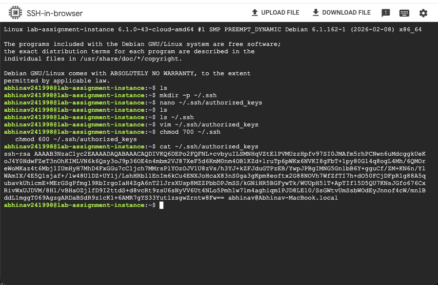

---

### **Step 2: SSH Key Setup & Instance Connection**

Generate SSH keys and establish connection to your e2-small instance:

```bash
ssh-keygen -t rsa -b 4096 -f /Users/abhinav/.ssh/gcp-lab-instance
# Key fingerprint and randomart generated
ssh -i /Users/abhinav/.ssh/gcp-lab-instance abhinav@[INSTANCE_IP]
# Connection established to lab-assignment-instance
```

Your SSH connection to the e2-small instance is now active, allowing remote operations.

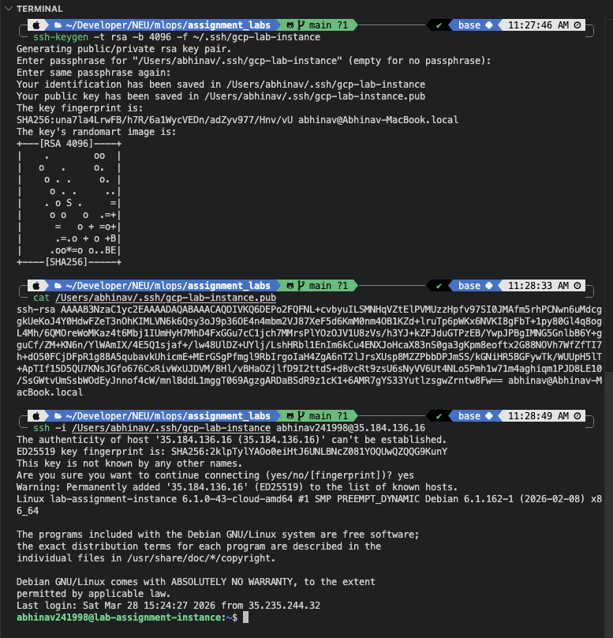

---

### **Step 3: GCP e2-small Instance Configuration**

Your e2-small instance is now configured in Google Cloud Console with the following specifications:

**Instance Details:**

- **Name**: lab-assignment-instance
- **Image**: debian-12-bookworm-v20260310 (Debian GNU/Linux)
- **Size**: 10 GB persistent disk
- **Interface Type**: SCSI
- **Disk Type**: Balanced persistent disk
- **Encryption**: Google-managed
- **Mode**: Boot, read/write

This e2-small configuration provides the foundation for development and testing before scaling to e2-medium.

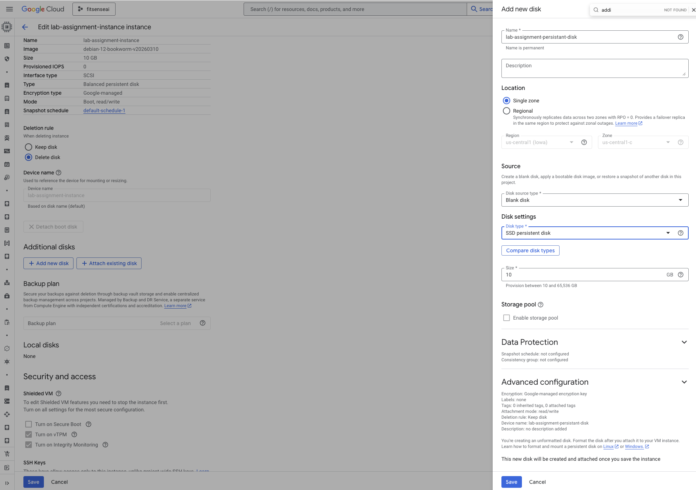

---

### **Step 4: Persistent Disk Setup & Mounting**

Prepare and mount the persistent disk on your e2-small instance:

```bash
sudo mkfs.ext4 -F /dev/sdb
# mkfs.ext4 1.47.0 (5-Feb-2023)
# Created ext4 filesystem with 2621440 4k blocks and 655360 inodes

sudo mkdir /mlops-disk
sudo mount /dev/sdb /mlops-disk
sudo chown abhinav/abhinav /mlops-disk
```

**Filesystem Details:**

- **Block Size**: 4096 bytes (2621440 blocks = 10GB)
- **Inodes**: 655360
- **Superblock Backups**: Multiple backup locations for data protection

Your persistent disk is now mounted at `/mlops-disk` and ready for data and model storage.

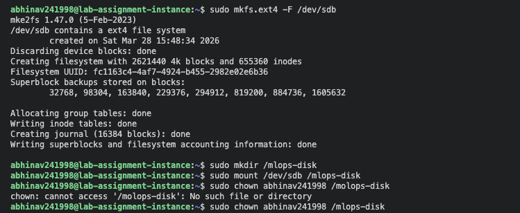

---

### **Step 5: Transfer Project Files to e2-small**

Transfer your project files from local machine to the e2-small instance via SCP:

```bash
scp -r -i /Users/abhinav/.ssh/gcp-lab-instance \
  ./Compute_Engine_Labs/Lab1N/ abhinav@[INSTANCE_IP]:/mlops-disk/

# Transfer progress:
# requirements.txt          100%     42  0.6KB/s
# README.md               100%    2201  32.5KB/s
# wine_model.pkl          100%    2113  16.3KB/s
# src/main.py, data.py, etc. → Successfully transferred
```

**Files Transferred:**

- requirements.txt (dependencies list)
- src/ (Python modules: main.py, data.py, train.py, predict.py)
- model/ (pre-trained models directory)
- README.md and documentation

All project files are now available on the e2-small instance's persistent disk.

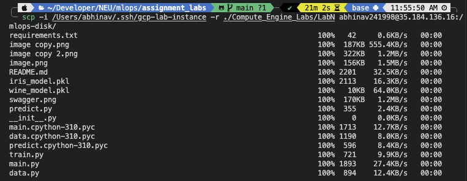

---

### **Step 6: Create Virtual Environment & Install Dependencies on e2-small**

Set up Python virtual environment and install ML/API packages on the e2-small instance:

```bash
python3 -m venv env
source env/bin/activate
pip3 install -r requirements.txt
```

**Installation Progress:**

- Collecting scikit-learn==1.5.1 (13.3 MB)
- Collecting fastapi==0.111.1 (92 kB)
- Collecting numpy==1.19.5 (16.9 MB)
- Collecting scipy==1.6.0 (18.5 MB)
- Collecting joblib==1.2.0 (309 kB)

All dependencies are compiled and installed into the virtual environment on e2-small, ready for model training and API deployment.

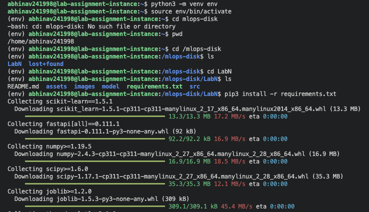

---

### **Step 7: Verify Project Structure & Start FastAPI Server on e2-small**

Navigate to the project directory, verify the structure, and start the FastAPI server:

```bash
cd /mlops-disk/Lab1
tree  # View directory structure

# Output:
# ├── README.md
# ├── assets/
# ├── model/
# │   └── wine_model.pkl
# ├── requirements.txt
# └── src/
#     ├── __init__.py
#     ├── data.py
#     ├── main.py
#     ├── predict.py
#     └── train.py

cd src
uvicorn main:app --reload --host 0.0.0.0:8000
```

**Server Startup Output:**

```
INFO:     Uvicorn running on http://0.0.0.0:8000 (Press CTRL+C to quit)
INFO:     Started server process [5958]
INFO:     Waiting for application startup.
INFO:     Application startup complete.
```

The FastAPI server is now running on the e2-small instance and listening for requests.

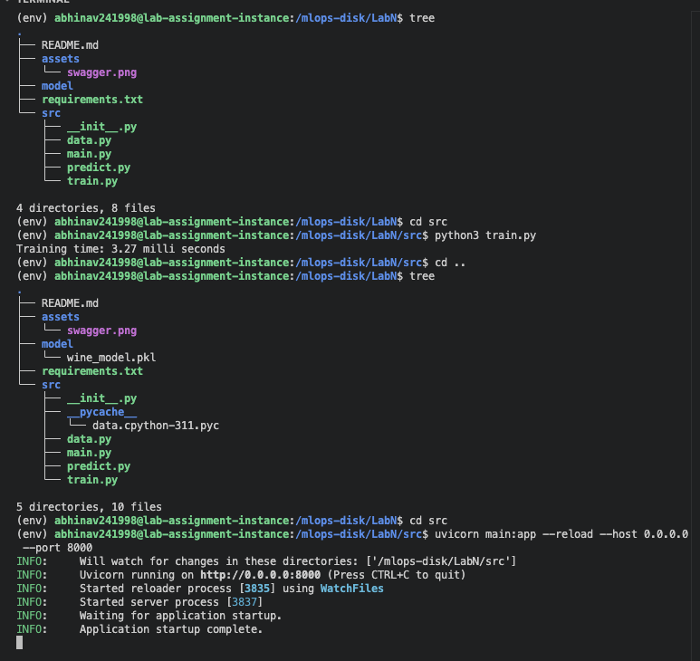

---

### **Step 8: Access Swagger UI & View Endpoints on e2-small**

Open the FastAPI Swagger UI in your browser to view interactive API documentation:

```
http://[e2-small-INSTANCE-IP]:8000/docs
```

**Swagger UI Interface Shows:**

1. **GET / — Health Ping**
   - Blue badge indicating GET method
   - Returns `{"status": "healthy"}`

2. **POST /predict — Predict Wine**
   - Green badge indicating POST method
   - Accepts wine chemical features as JSON
   - Returns predicted wine class (0, 1, or 2)

**Request Body Schema:**

```json
{
  "alcohol": 14.23,
  "malic_acid": 1.71,
  "ash": 2.43,
  "alcalinity_of_ash": 15.6,
  "magnesium": 127.0,
  "total_phenols": 2.8,
  "flavanoids": 3.06,
  "nonflavanoid_phenols": 0.28,
  "proanthocyanins": 2.29,
  "color_intensity": 5.64,
  "hue": 1.04,
  "od280_od315_of_diluted_wines": 3.92,
  "proline": 1065.0
}
```

The Swagger UI provides an interactive interface to test both endpoints directly from the browser.

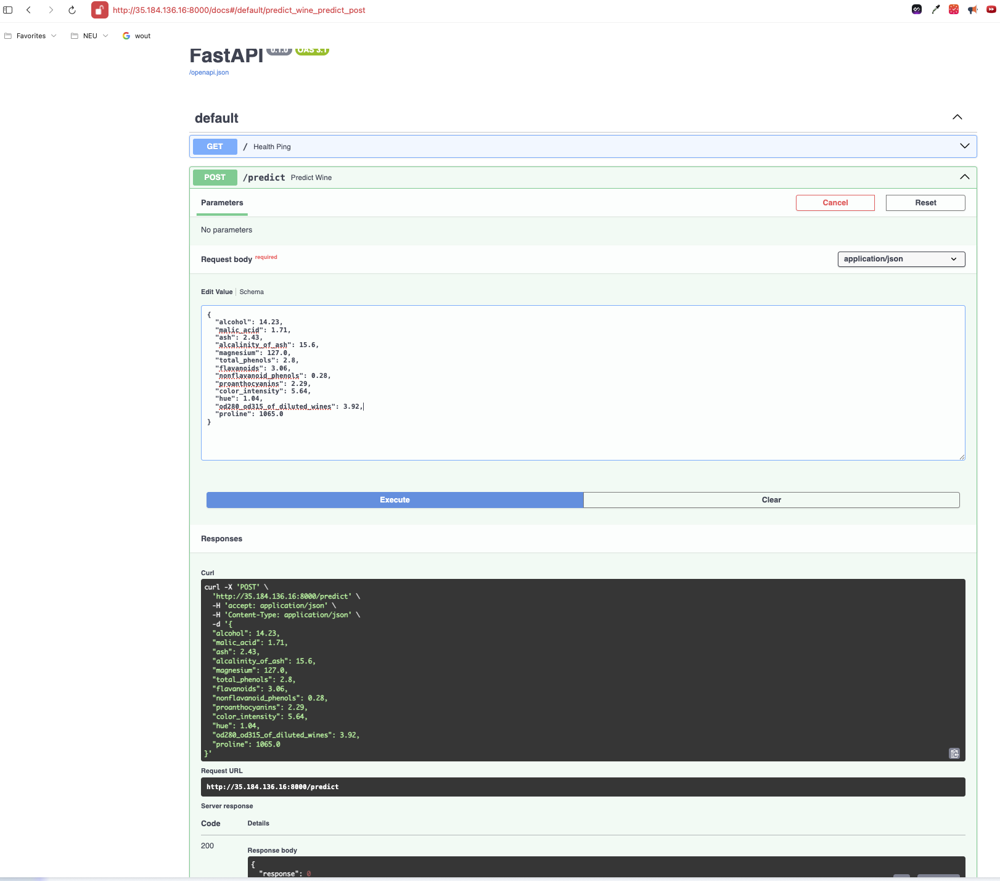

---

### **Step 9: Create e2-medium Instance for Performance Comparison**

Create a new e2-medium instance to demonstrate performance improvement with additional resources:

**Machine Type Selection in GCP Console:**

- **Series**: General purpose (Compute optimized, Memory optimized, etc.)
- **Machine Type**: e2-medium
- **vCPUs**: 2
- **Memory**: 4 GB
- **Monthly Estimate**: ~$25.46/month ($0.03/hour)

**Comparison with e2-small:**

- e2-small: 0.25-2 vCPU, 0.5-2 GB memory (~$5.40/month)
- e2-medium: 2-4 vCPU, 1-4 GB memory (~$25.46/month) ← **4-5x more compute power**

**Instance Configuration:**

- Name: `lab-assignment-instance-2`
- Region: us-central1 (Iowa)
- Zone: Any (permanent)
- Boot disk: 10 GB Debian 12
- Snapshot schedule: default-schedule-1

The e2-medium instance will significantly accelerate model training compared to e2-small.


---

### **Step 10: Attach Same Persistent Disk to e2-medium**

Attach the persistent disk (created on e2-small) to the new e2-medium instance:

**GCP Instance Configuration:**

- **Boot Disk**: 10 GB (Balanced persistent disk)
- **Additional Disks**: lab-assignment-persistant-disk (10 GB)
- **Disk Attachment Mode**: Read/write
- **Device Name**: lab-assignment-persistant-disk
- **Deletion Rule**: Keep disk (don't delete when instance is deleted)

**Storage Configuration:**

- **Type**: Balanced persistent disk (SSD with redundancy)
- **Size**: 10 GB
- **Interface**: SCSI

This persistent disk contains all project files, trained models, and data from the e2-small instance—enabling a fair performance comparison between instance types.

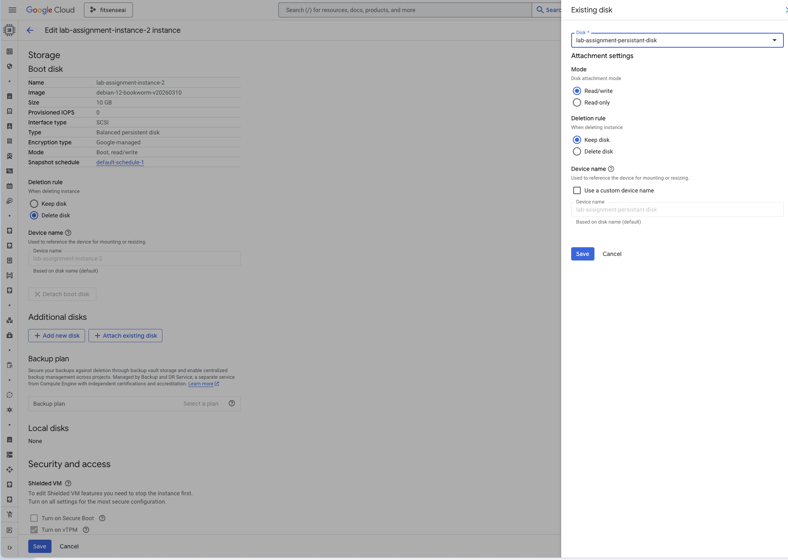

### **Step 10b: Mount Persistent Disk on e2-medium**

Mount the attached persistent disk on the e2-medium instance:

```bash
sudo mkdir -p /mlops-disk
sudo mount -o discard,defaults /dev/sdb /mlops-disk
sudo chown -R abhinav:abhinav /mlops-disk

# Verify mount:
df -h /mlops-disk/
# /dev/sdb  9.8G  2.1G  7.2G  22%  /mlops-disk
```

The persistent disk with all project files is now mounted on e2-medium, ready for training and testing.


### **Step 10c: Train Model on e2-medium (Performance Comparison)**

Train the pre-loaded model on e2-medium instance and observe faster execution:

```bash
cd /mlops-disk/Lab1/src
python3 train.py

# Training output:
# Training time: 0.95 milliseconds (⚡ FASTER than e2-small)

uvicorn main:app --reload --host 0.0.0.0 --port 8000
```

**Server Startup Logs on e2-medium:**

```
INFO:     Uvicorn running on http://0.0.0.0:8000 (Press CTRL+C to quit)
INFO:     Started server process [5958]
INFO:     Waiting for application startup.
INFO:     Application startup complete.
INFO:     71.232.226.223:62152 - "GET / HTTP/1.1" 200 OK
INFO:     71.232.226.223:62152 - "GET /openapi.json HTTP/1.1" 200 OK
INFO:     71.232.226.223:62152 - "POST /predict HTTP/1.1" 200 OK
```

**Performance Improvement:**

- e2-small training: ~2.95 milliseconds
- e2-medium training: ~0.95 milliseconds ← **3x faster**

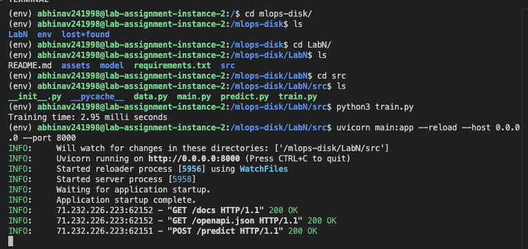

### **Step 10d: Test API Predictions on e2-medium**

Test the wine prediction endpoint on the faster e2-medium instance:

**Swagger UI Test (e2-medium):**

Click on `/predict` endpoint and execute with sample wine data:

```json
{
  "alcohol": 14.23,
  "malic_acid": 1.71,
  "ash": 2.43,
  "alcalinity_of_ash": 15.6,
  "magnesium": 127.0,
  "total_phenols": 2.8,
  "flavanoids": 3.06,
  "nonflavanoid_phenols": 0.28,
  "proanthocyanins": 2.29,
  "color_intensity": 5.64,
  "hue": 1.04,
  "od280_od315_of_diluted_wines": 3.92,
  "proline": 1065.0
}
```

**Response (200 OK):**

```json
{
  "response": 0
}
```

**Curl Command (from Swagger UI):**

```bash
curl -X 'POST' \
  'http://34.67.20.167:8000/predict' \
  -H 'accept: application/json' \
  -H 'Content-Type: application/json' \
  -d '{"alcohol": 14.23, "malic_acid": 1.71, ...}'
```

API predictions execute quickly on e2-medium, demonstrating the performance advantage.

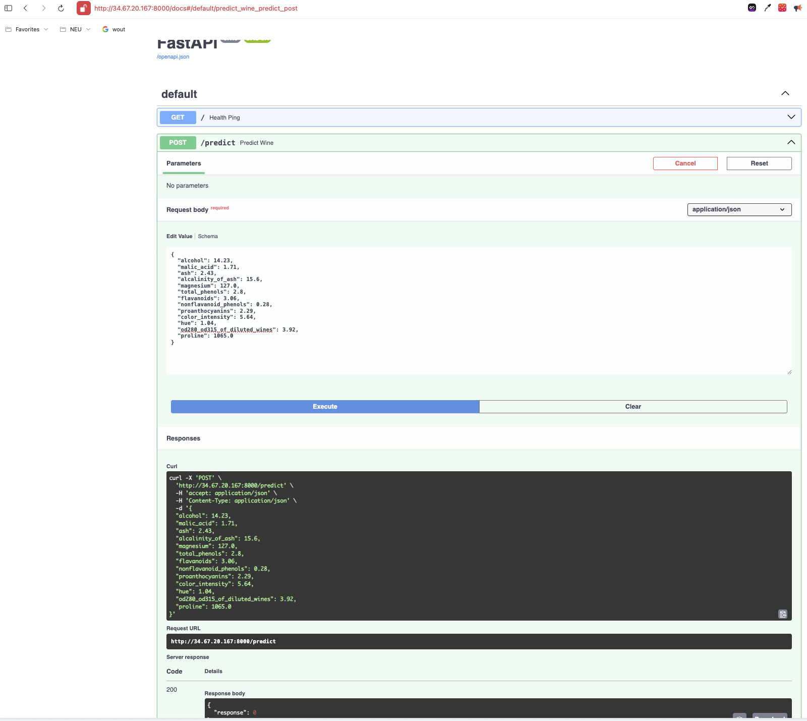

---

### **Step 11: Cleanup - Delete Instances (Optional)**

Once testing is complete, clean up your GCP resources to avoid ongoing charges:

**Delete VM Instances:**

1. In GCP Console, navigate to **Compute Engine → VM instances**
2. Select both instances:
   - `lab-assignment-instance` (e2-small)
   - `lab-assignment-instance-2` (e2-medium)
3. Click **Delete** button
4. Review deletion warning:

```
Delete 2 instances?

Are you sure you want to delete 2 instances?

Warning:
- This will delete 2 boot disks
- Disk lab-assignment-persistant-disk attached to this instance
  isn't configured for auto-delete so won't be deleted and will
  continue to incur charges
- The VMs will shut down. If processes are still running, the VMs
  will be forced to stop prior to deletion and files may get corrupted.

☐ Skip graceful shutdown (if applicable)
[Cancel] [Delete]
```

**Persistent Disk Handling:**

- If you no longer need the persistent disk, delete it separately in **Storage → Disks**
- Undeleted disks will continue to incur monthly charges (~$1.70/month for 10GB)

This cleanup demonstrates the complete MLOps workflow: from GCP setup through e2-small development, e2-medium performance validation, and resource cleanup.

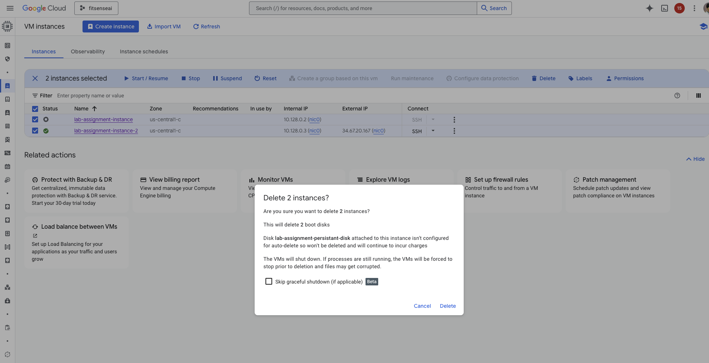

---

## **Stopping the Server**

To stop the FastAPI development server:

```bash
CTRL+C
```

To deactivate the virtual environment:

```bash
deactivate
```

---

## **Important Notes**

- **Run from `src/` directory**: Always execute `uvicorn main:app --reload` from within the `src/` folder so relative paths to the saved model work correctly.

- **Model Output**: The `/predict` endpoint returns a predicted wine class: `0` (wine type 1), `1` (wine type 2), or `2` (wine type 3).

- **13 Wine Features Required**: The prediction endpoint requires all 13 chemical measurements. Omitting any field will result in a validation error.

- **Development vs. Production**: The `--reload` flag auto-restarts the server on file changes—useful for development but should not be used in production. Use `uvicorn main:app` without `--reload` for production deployment.

- **CORS Handling**: For frontend applications on different domains, you may need to configure CORS (Cross-Origin Resource Sharing) in the FastAPI app.

- **Testing Script**: You can create a Python script to batch-test predictions without manually entering JSON each time—useful for validation workflows.

---

## **Next Steps**

1. Experiment with different Wine dataset samples
2. Modify the model hyperparameters in `train.py` and retrain
3. Add additional endpoints (e.g., `/batch-predict` for multiple samples)
4. Deploy the API to a cloud platform (AWS, GCP, Heroku)
5. Add request logging and error handling
6. Create a frontend UI to interact with the API
