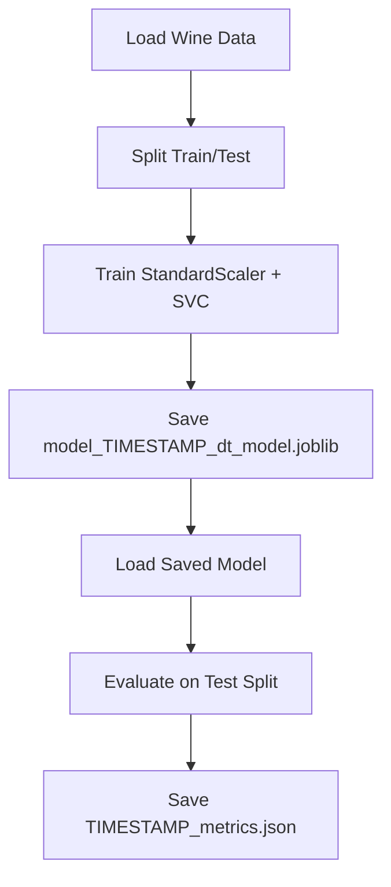
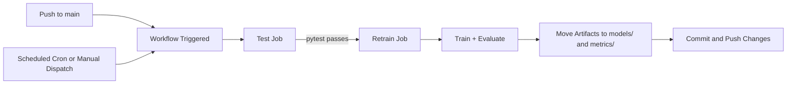

# GitHub Lab 2: Automated Model Retraining With GitHub Actions

This lab demonstrates an end-to-end MLOps loop where a model is tested, retrained, evaluated, versioned, and committed automatically through GitHub Actions.

The model pipeline in this lab uses the scikit-learn Wine dataset with a StandardScaler + SVC (RBF) classifier.

## What This Lab Does

1. Loads and splits the Wine dataset.
2. Trains a model in src/train_model.py.
3. Evaluates the saved model in src/evaluate_model.py.
4. Writes versioned artifacts:
   - models/model\_<timestamp>\_dt_model.joblib
   - metrics/<timestamp>\_metrics.json
5. Runs tests before retraining in CI.
6. Commits updated artifacts back to the repository when there are changes.

## Pipeline Flow



## GitHub Actions Flow



## Project Layout

```text
Github_Labs/Lab2/
├── README.md
├── requirements.txt
├── src/
│   ├── data.py
│   ├── train_model.py
│   └── evaluate_model.py
├── test/
│   └── test_src_pipeline.py
├── metrics/
├── models/
└── workflows/
```

## How To Run Locally

### 1) Install Dependencies

From the Lab2 folder:

```bash
cd Github_Labs/Lab2
pip install -r requirements.txt
```

### 2) Run Tests

```bash
pytest -q
```

### 3) Train the Model

Use any timestamp string (for example YYYYMMDDHHMMSS):

```bash
python src/train_model.py --timestamp 20260419170000
```

This creates:

- model_20260419170000_dt_model.joblib

### 4) Evaluate the Model

```bash
python src/evaluate_model.py --timestamp 20260419170000
```

This creates:

- 20260419170000_metrics.json

If needed, move artifacts to the versioned folders:

```bash
mkdir -p models metrics
mv model_20260419170000_dt_model.joblib models/
mv 20260419170000_metrics.json metrics/
```

## How GitHub Actions Is Used

The runnable workflows are in the repository-level .github/workflows folder:

- .github/workflows/model_calibration_on_push.yml
- .github/workflows/model_calibration.yml

### model_calibration_on_push.yml

- Trigger: push to main.
- Stages:
  1.  test job: install dependencies and run pytest.
  2.  retrain job (needs test): train, evaluate, move artifacts, commit/push.

### model_calibration.yml

- Trigger:
  - Scheduled daily run via cron.
  - Manual run via workflow_dispatch.
- Stages:
  1.  test job.
  2.  retrain job after successful tests.

## Notes

1. The model filename keeps the \_dt_model suffix for compatibility with existing lab workflow naming.
2. The CI commit message includes [skip ci] to avoid recursive pipeline loops.
3. Workflow copies may also exist in Github_Labs/Lab2/workflows for reference, but GitHub executes files from .github/workflows.
